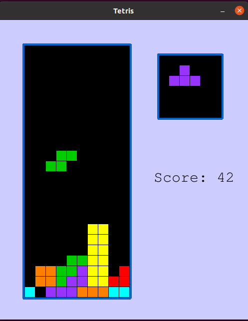
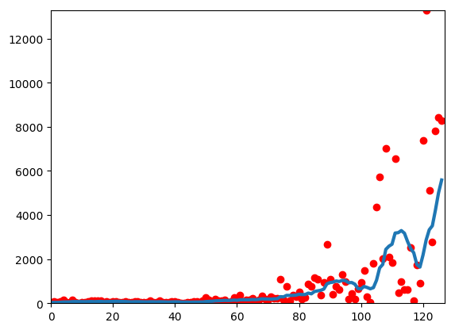

# Reinforcement Learning agent for playing Tetris in Python.

## What is it?

This is a simple implementation of Tetris that allows both a human player and an AI bot to play. It also contains an implementation of a Reinforcement Learning based bot that learns from its own play and gets gradually better to finally achieve scores of tens of thousands of points (which means it can go on for tens of thousands "piece drops").

## Instructions on How to Run

In order to run this code you need to satisfy the following dependencies:
 - `Python 3`
 - `NumPy`
 - `SciPy`
 - `Matplotlib` 
 - `Pygame` 

If you want to play Tetris yourself, just run `python Tetris.py`.
To see how my trained Agent handles this task, run `python Tetris-Ben.py`.
 

## Ben: the Reinforcement Learning Agent

The implemented **Reinforcement Learning** strategy uses approximate **Q-Learning** to make moves. The training runs are generated using the  `eps`-greedy strategy.

The state in the game is a pair `(Board, Piece)` where `Board` is the full state of the board (a rectangular bit array saying which cells are occupied) and `Piece` is one of `['I','J','L','O','S','Z','T']` representing which piece is being dropped at the moment. An action is represented by `horizontal position` + `rotation` which we think are applied instanteunously when the new piece shows up. This is a certain simplification (as normally you can move the piece left right during the drop and then possible "fit" it in some gap) but it only reduces the possibilities of the agent (and in particular the agent is not cheating in any way). This simplification is made to make the space of actions smaller and consequently to better model the problem using RL techniques.

Since the set of states is exponential in size,  we cannot use "exact" **Q-learning** but need to make na approximation to the **Q-value** function. More specifically, for a state-action pair `(s, a)` let `B` be the board state that results in applying the action `a` to state `s`, we then approximate `Q(s,a)` by `F(B)` which is a sum of the form
`w_1*b_1 + w_2*b_2 + ... + w_N * b_N`
where `(w_1, w_2, ..., w_N)` is a **vector of weights** and   `(b_1, b_2, ..., b_N)` is the **vector of features** that are computed from `B`. More specifically, the feature vector includes for instance values such as:

 1. The heighest occupied cell for each column,
 2. The number of "holes",
 3. The total area of "holes",
 4. The fraction of the board that is filled (with respect to the highest column).

Given that, the weight vector `(w_1, w_2, ..., w_N)` is learned using the standard **Q-learning** algorithm. See below for a plot of the performance of the agent in the subsequent epoch numbers: the red dots represent actual scores achieved by the agent and the blue line is the running average.

